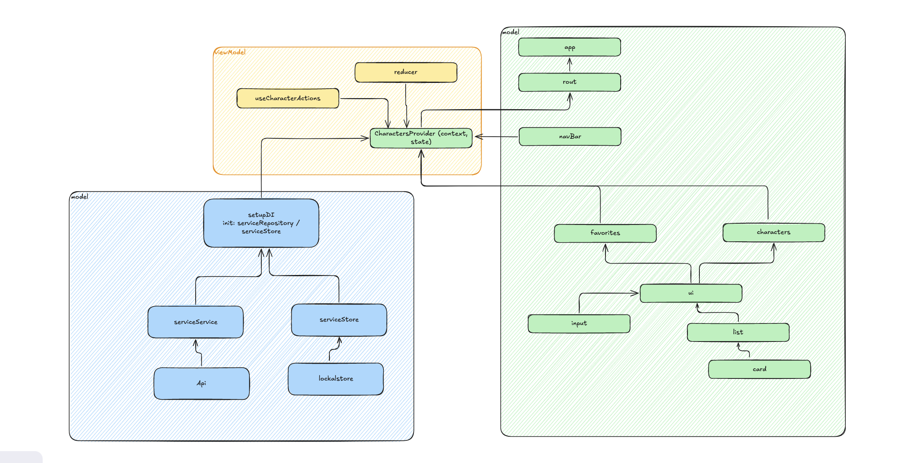

# Rick & Morty

1. Model (Левая часть - синий блок)
    `Api` - `интерфейс` работа с внешним `API`
    `LocalStore` - `интерфейс` реализация для работы с `localStorage`
    `serviceService` и `serviceStore` - сервисные слои (`CharacterService` и `CharactersStore`)

2. `ViewModel` (Центральная часть - желтый блок)
    `CharactersProvider` - главный контекст с состоянием
    `reducer` - управление состоянием
    `useCharacterActions` - кастомный хук с бизнес-логикой

3. `View` (Правая часть - зеленый блок)
    `UI` компоненты: `app`, `rout`, `navBar`, `input`, `list`, `card`
    Данные: `characters` и `favorites`

при выборе `favorites` в `localStorage` добавляются `id` но при этом если обновить страницу то не все `favorites` будут доступны так как
они не пришли с `back` (или добавить запрос на бэк, для получения не загруженных `favorites` или добавлять в `localStorage`)

